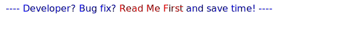

 
# DashT - and OpenCPN plug-in with Dashboard, Tactics, Engine/Energy dials and Time Series DB functions

_dashboard_tactics_pi_ in your OpenCPN plug-in catalog.

## Introduction

_DashT_ [v1.5.11](https://github.com/canne/dashboard_tactics_pi/releases/tag/v1.5.11) was a forerunner in diversifying the data connectivity of a OpenCPN plug-in to enable direct network connections to resources available in a modern boat's computer and network infrastructure.

With the arrival of the next OpenCPN version we will see it embracing the open marine data format [Signal K](https://opencpn.org/wiki/dokuwiki/doku.php?id=opencpn:supplementary_software:signalk). This is excellent news and hopefully encouraging you to install a fast, ubiquitous and reliable Signal K data format source in your boat's infrastructure: [Signal K server node](https://github.com/SignalK/signalk-server-node). It has been supported since day zero by _DashT_ allowing the creation of enhancements which are not present in the traditional OpenCPN Dashboard:

* OpenCPN's Dashboard integrated

  * No need to swap between the two plug-ins!
  * Signal K data is not required for these instruments, NMEA-0183 is enough

* [Tactics and performance functions intergrated](docs/Tactics.md)

  * Also integrated, no need to swap
  * Works fine with NMEA-0183 but will profit from the faster, timestamped wind data provided by Signal K

* [Engine and Energy dials](https://canne.github.io/dashboard_tactics_pi/docs/webview/README.html)

  * Provides Signal K engine and energy data on dials built using latest web techniques but fully integrated in OpenCPN Dashboard
  * Best explained by this [short video](https://vimeo.com/391601955) (on a very small display)

* [Influx DB 2.0 ouput streaming and export](https://canne.github.io/dashboard_tactics_pi/docs/influxdb/InfluxDBStreamer.html)

  * Time series based databases are essential with the data volumes and rates created by Signal K enabled servers
  
  * Real-time storage and retrieval allows monitoring and historical data browsing using tools such as Grafana
  
  * An all-received-data dump-file can be registered to feed off-line InfluxDB v2.0 time series database
  
    * Enhances post-race analysis and off-line polar calculations with high sampling rate data

* [Signal K data input streaming](https://canne.github.io/dashboard_tactics_pi/docs/signalk/SignalKInputStreamerUsage.html)

  * Direct connection to the delta channel of a Signal K server node providing shortest possible path for:

    * Maximum volume of data ;
    * Lowest possible latency ;
    * Time stamps at source ;
    * Access to Engine, Energy and Status data from NMEA-2000, Bluetooth LE, GPIO over a single interface.

* [Comprehensive documentation](https://canne.github.io/#DashT%20-%20plug-in%20for%20OpenCPN)

  * Detailed User's Manuals
  * Developer's information with performance analysis and debugging tips

## Installation

See the [Releases](https://github.com/canne/dashboard_tactics_pi/releases) pages: pre-build packages for platforms Windows, Mac, Linux Ubuntu/Debian, Raspberry Pi 4.

## Configuration

Please refer to User's Guides accessible from the [documentation pages](https://canne.github.io/#DashT%20-%20plug-in%20for%20OpenCPN)

## Compiling

* git clone git://github.com/canne/dashboard_tactics_pi.git

### Windows build

>Under Windows, please get first the library file "_opencpn.lib_" (Visual Studio). It is located in the build directory of [OpenCPN](https://github.com/OpenCPN/OpenCPN) after having built it; or your can search it from the various processes of CI (continuous integration) of this plug-in. Copy the library file matching the target OpenCPN version into the build directory before launching the following:

* cd build
* cmake  -T v140_xp ..
* cmake --build . --target package --config release

### Unix style build

* cd build
* cmake ..
* make
* make package
* sudo make install

### License

The project is licensed under the terms of the GPL v3. The networked parts of the project are derived from and licensed under MIT license.
