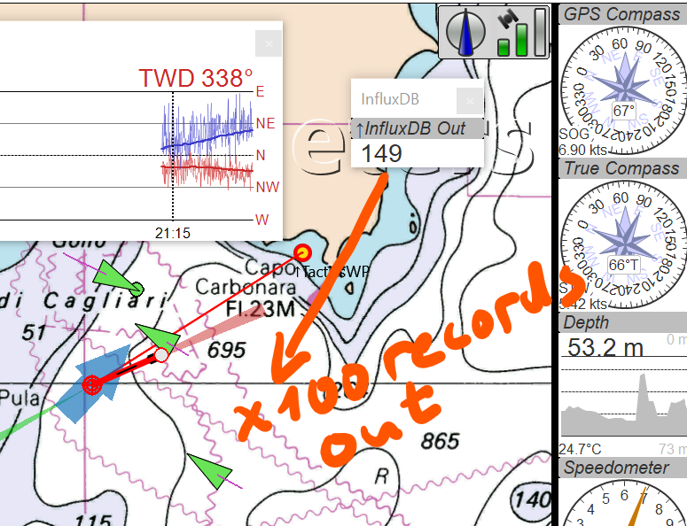
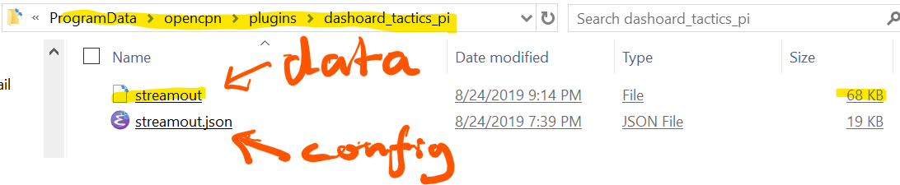
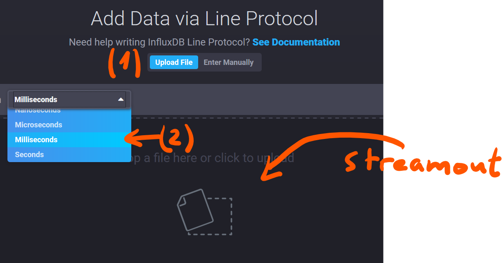
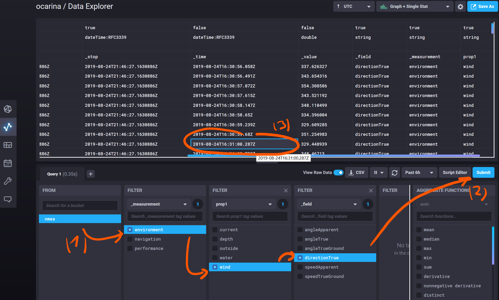

# Dashboard-Tactics InfluxDB 2.0 Streamer - User's Guide

## Introduction

[Influx data](https://www.influxdata.com/)'s [InfluxDB 2.0](https://www.influxdata.com/products/influxdb-overview/influxdb-2-0/) is in advanced alpha phase (_when this is written_) which allows us to develop a connector between Dashboard-Tactics OpenCPN 5 plug-in and this time-series platform. Most natural usage is to export all data received by the plug-in into Influx DB 2.0. 

InfluxDB [Line Protocol to write data](https://v2.docs.influxdata.com/v2.0/write-data/) is used. Two of the available methods are supported, streaming to InfluxDB 2.0 HTTP server and writing to a Line Protocol-format file which is later imported using InfluxDB 2.0 UI.

## Streaming to InfluxDB 2.0 HTTP server

This method, with a rich variety of configuration possibilities is best explained in a dedicated document which takes the _streaming into a InfluxDB 2.0 server on a Docker container_ ([md](StreamingToDockerInfluxDB.md) | [ipynb](StreamingToDockerInfluxDB.ipynb) | [html](StreamingToDockerInfluxDB.html)) as a use case. Before starting, please study first the method using an intermediate file explained below.

## Streaming into Line Protocol format export file

This is the easiest way to get started since no running Influx DB 2.0 UI server is needed for now. It is also the fastest way to collect data for InfluxDB, limited only by the writing speed of your hard disk. Potentially, but depending of you boat's instruments, over thirty different types of measurement values received by various Dashboard Intstruments can be saved, some of them a few times per second. Since modern disks can easily store data with these rates and volumes, it is the safest option what comes performance and ease of use:

Start your OpenCPN v5 with Dashboard-Tactics.

Open the Preferences dialog and create a new instrument panel with a single instrument in it: _InfluxDB Out_:


That's it! Data coming in from OpenCPN (there is always some) is already collected and a background thread is busy writing those into a file.


Data rate is so slow, that no movement can be yet observed. Let's start moving to produce some real data with maximum throughput.

[](img/screenshots/2019-08-24_212329_InfluxOut_DataOut_x_100_counter.png)

The counter in the InfluxDB Out "instrument" indicates the blocks of data written out, default block size is 100. More detailed information can be made available on-demand in the OpenCPN log file, see below for debugging.

The data is going out into a file, which is written in the directory for user and plug-in data, which depends of your system. In Windows:

[](img/screenshots/2019-08-24_211800_InfluxOut_DataDirectory.png)

In Linux, the directory path is `~/.opencpnplugins/dashboard_tactics_pi`

The Influx DB 2.0 Line Protocol data is written out in a file called by default `streamout`.

### Backup copies of InfluxDB 2.0 line protocol data files

At each start of InfluxDB 2.0 plug-in an existing `streamout` InfluxDB 2.0 line protocol file is renamed as `streamout_bup_YYYY-MM-DD_hh:mm:ss` where the `YYYY-MM-DD_hh:mm:ss` is the time of the backup and **not** the time of the data inside that file.

#### Finding the time range of a backup copies

To find out the period of the data inside a backup file open it an use on-line service accepting timestamps in milliseconds such as https://www.epochconverter.com to convert the timestamp of the first and last line.   

### Configuration file management

The configuration file and the database schema are in a single file, located in the same data directory. It can be edited. There is a template file located in the plug-in's program directory dashboard_tactics_pi from where it should be copied (and not modified) if need arise.

It is possible to have more than one configuration settings and, consequently more than one database schema - you can add tags, or otherwise modify the schema to facilitate the data browsing. You can also switch between file based and http:// based operation. But only one configuration file can be used at a time. Select its name in the OpenCPN configuration file (.ini or .conf):

```[PlugIns/Dashboard/Tactics/Streamout]
ConfigFile=streamout.json```

### Importing data with InfluxDB 2.0 UI

Get into a InfluxDB 2.0 UI (_e.g._[Docker based installation](StreamingToDockerInfluxDB.ipynb)) and go to the Bucket administration in configuration tab.

[](img/screenshots/2019-08-24_234211_InfluxOut_Import_LineProtocolFile.png)

**Select milliseconds as timestamp units** and drag-and-drop or browse the streamout-file into the InfluxDB 2.0 UI.

[](img/screenshots/2019-08-24_235041_InfluxOut_Select_ms_and_drop-ini.png)

Confirmation, no error messages.

[](img/screenshots/2019-08-24_235138_InfluxOut_import_OK.png)

Make a query, select View Raw Data and observe that the data timestamps are correct. Note that all time is UTC and the InfluxDB 2.0 UI needs to be set the same.

[](img/screenshots/2019-08-24_235204_InfluxOut_check_raw_data.png)

## Debugging

The output file, _streamout_ is a text file which can be visualized and its filling can be followed up with the command line tools.

It is possible to increase also the verbosity level of the log messages, values 3 - 5 makes more debug printing out in the OpenCPN log file.

### Level 4

Verbosity level 4 is printing out every second the status of the FIFO queue between the streamer instrument and the file writing and data communication thread, which is useful if buffer overrun is suspected

On Windows PowerShell:

```
PS C:\ProgramData\opencpn\plugins\dashoard_tactics_pi>
Get-Content ./streamout -Wait -Tail 20
```
```
PS C:\ProgramData\opencpn>
Get-Content ./opencpn.log -Wait -Tail 20
```

On *nix systems:

`tail -f ~.opencpnplugins/dashboard_tactics_pi/streamout`

`tail -f ~.opencpn/opencpn.log`

### Level 5

Level 5 is useful to debug issues with the HTTP printing out the entire header and data POST message (one may want to **reduce the number of lines** to be sent per POST in this case)
