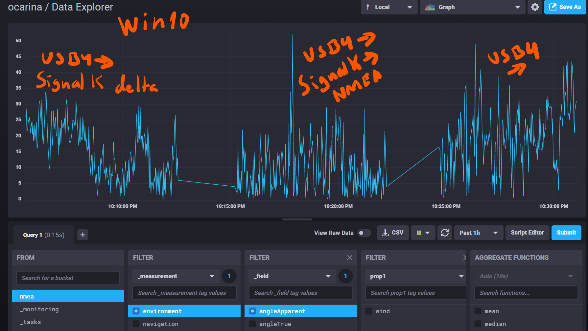
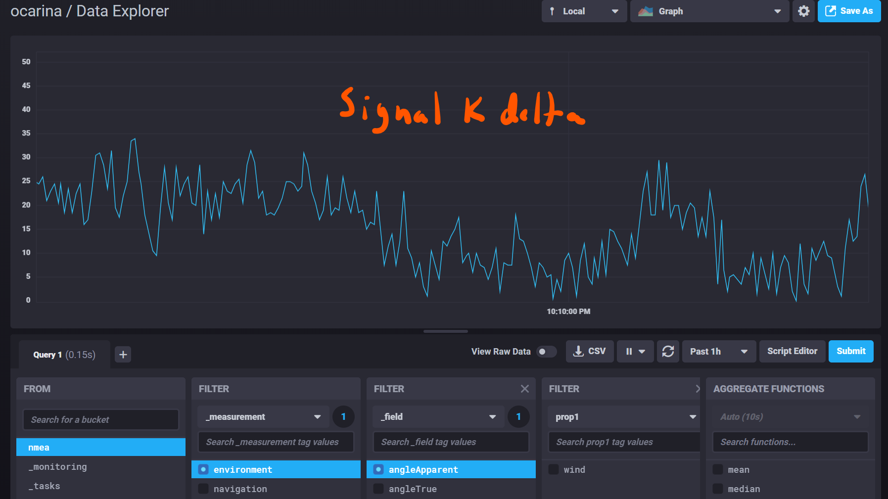

# Comparison of timestamps in three alternative NMEA data paths

We observe a five minute sampling period stored in InfluxDB database for each of the use case for single value of Apparent Wind Angle:

1. data via Signal K delta TCP channel with Signal K timestamps at its own reception

2. data via Signal K to NMEA-0183 via TCP channel timestamps at reception at the InfluxDB instruments

3. data directly from USB to OpenCPN

In all above cases the USB is set to 115200 baud at reception on Win10 running OpenCPN v5.0.0. Data is originated from Raymarine SeaTalk (4800 baud) and converted to USB in MiniPlex II multiplexer - about 40 values per second are transmitted through this channel but only Apparent Wind Angle timestamp behaviour is observed.

[](2019-10-05_224016_3x_data_series_overview.png)


```python
import numpy as np
import pandas as pd
```

## 1. Data via Signal K delta TCP channel

[](2019-10-05_224308_SignalK_delta_zoom.png)


```python
df = pd.read_csv("2019-10-05_224308_SignalK_delta_zoom.csv", sep=',', header=3)
```


```python
df.head()
```


<div>
<style scoped>
    .dataframe tbody tr th:only-of-type {
        vertical-align: middle;
    }

    .dataframe tbody tr th {
        vertical-align: top;
    }

    .dataframe thead th {
        text-align: right;
    }
</style>
<table border="1" class="dataframe">
  <thead>
    <tr style="text-align: right;">
      <th></th>
      <th>Unnamed: 0</th>
      <th>result</th>
      <th>table</th>
      <th>_start</th>
      <th>_stop</th>
      <th>_time</th>
      <th>_value</th>
      <th>_field</th>
      <th>_measurement</th>
      <th>prop1</th>
    </tr>
  </thead>
  <tbody>
    <tr>
      <td>0</td>
      <td>NaN</td>
      <td>NaN</td>
      <td>0</td>
      <td>2019-10-05T20:06:00Z</td>
      <td>2019-10-05T20:11:00Z</td>
      <td>2019-10-05T20:06:00.969Z</td>
      <td>16.0</td>
      <td>angleApparent</td>
      <td>environment</td>
      <td>wind</td>
    </tr>
    <tr>
      <td>1</td>
      <td>NaN</td>
      <td>NaN</td>
      <td>0</td>
      <td>2019-10-05T20:06:00Z</td>
      <td>2019-10-05T20:11:00Z</td>
      <td>2019-10-05T20:06:02.904Z</td>
      <td>17.0</td>
      <td>angleApparent</td>
      <td>environment</td>
      <td>wind</td>
    </tr>
    <tr>
      <td>2</td>
      <td>NaN</td>
      <td>NaN</td>
      <td>0</td>
      <td>2019-10-05T20:06:00Z</td>
      <td>2019-10-05T20:11:00Z</td>
      <td>2019-10-05T20:06:04.841Z</td>
      <td>23.0</td>
      <td>angleApparent</td>
      <td>environment</td>
      <td>wind</td>
    </tr>
    <tr>
      <td>3</td>
      <td>NaN</td>
      <td>NaN</td>
      <td>0</td>
      <td>2019-10-05T20:06:00Z</td>
      <td>2019-10-05T20:11:00Z</td>
      <td>2019-10-05T20:06:06.775Z</td>
      <td>30.5</td>
      <td>angleApparent</td>
      <td>environment</td>
      <td>wind</td>
    </tr>
    <tr>
      <td>4</td>
      <td>NaN</td>
      <td>NaN</td>
      <td>0</td>
      <td>2019-10-05T20:06:00Z</td>
      <td>2019-10-05T20:11:00Z</td>
      <td>2019-10-05T20:06:08.71Z</td>
      <td>31.0</td>
      <td>angleApparent</td>
      <td>environment</td>
      <td>wind</td>
    </tr>
  </tbody>
</table>
</div>


```python
df._value.describe()
```


    count    158.000000
    mean      16.382911
    std        8.111321
    min        0.500000
    25%        9.500000
    50%       17.250000
    75%       23.000000
    max       34.000000
    Name: _value, dtype: float64


```python
df1 = pd.to_datetime(df['_time'])
```


```python
df1.describe()
```


    count                                  158
    unique                                 158
    top       2019-10-05 20:09:49.403000+00:00
    freq                                     1
    first     2019-10-05 20:06:00.969000+00:00
    last      2019-10-05 20:10:58.127000+00:00
    Name: _time, dtype: object


```python
df2 = df1.astype(np.int64).div(1e6)
```


```python
df3 = df2.diff()
```


```python
df3.describe()
```


    count     157.000000
    mean     1892.726115
    std       188.331733
    min      1001.000000
    25%      1925.000000
    50%      1935.000244
    75%      1940.000000
    max      2058.000244
    Name: _time, dtype: float64


## 2. Data via Signal K to NMEA-0183 converter TCP channel

[](2019-10-05_224509_SignalK_NMEA_TCP_zoom.png)


```python
nf = pd.read_csv("2019-10-05_224509_SignalK_NMEA_TCP_zoom.csv", sep=',', header=3)
```


```python
nf.head()
```


<div>
<style scoped>
    .dataframe tbody tr th:only-of-type {
        vertical-align: middle;
    }

    .dataframe tbody tr th {
        vertical-align: top;
    }

    .dataframe thead th {
        text-align: right;
    }
</style>
<table border="1" class="dataframe">
  <thead>
    <tr style="text-align: right;">
      <th></th>
      <th>Unnamed: 0</th>
      <th>result</th>
      <th>table</th>
      <th>_start</th>
      <th>_stop</th>
      <th>_time</th>
      <th>_value</th>
      <th>_field</th>
      <th>_measurement</th>
      <th>prop1</th>
    </tr>
  </thead>
  <tbody>
    <tr>
      <td>0</td>
      <td>NaN</td>
      <td>NaN</td>
      <td>0</td>
      <td>2019-10-05T20:16:00Z</td>
      <td>2019-10-05T20:21:00Z</td>
      <td>2019-10-05T20:16:01.101Z</td>
      <td>1.5</td>
      <td>angleApparent</td>
      <td>environment</td>
      <td>wind</td>
    </tr>
    <tr>
      <td>1</td>
      <td>NaN</td>
      <td>NaN</td>
      <td>0</td>
      <td>2019-10-05T20:16:00Z</td>
      <td>2019-10-05T20:21:00Z</td>
      <td>2019-10-05T20:16:03.041Z</td>
      <td>13.5</td>
      <td>angleApparent</td>
      <td>environment</td>
      <td>wind</td>
    </tr>
    <tr>
      <td>2</td>
      <td>NaN</td>
      <td>NaN</td>
      <td>0</td>
      <td>2019-10-05T20:16:00Z</td>
      <td>2019-10-05T20:21:00Z</td>
      <td>2019-10-05T20:16:04.981Z</td>
      <td>0.5</td>
      <td>angleApparent</td>
      <td>environment</td>
      <td>wind</td>
    </tr>
    <tr>
      <td>3</td>
      <td>NaN</td>
      <td>NaN</td>
      <td>0</td>
      <td>2019-10-05T20:16:00Z</td>
      <td>2019-10-05T20:21:00Z</td>
      <td>2019-10-05T20:16:06.015Z</td>
      <td>15.0</td>
      <td>angleApparent</td>
      <td>environment</td>
      <td>wind</td>
    </tr>
    <tr>
      <td>4</td>
      <td>NaN</td>
      <td>NaN</td>
      <td>0</td>
      <td>2019-10-05T20:16:00Z</td>
      <td>2019-10-05T20:21:00Z</td>
      <td>2019-10-05T20:16:07.881Z</td>
      <td>7.0</td>
      <td>angleApparent</td>
      <td>environment</td>
      <td>wind</td>
    </tr>
  </tbody>
</table>
</div>


```python
nf._value.describe()
```


    count    159.000000
    mean      10.710692
    std        8.320781
    min        0.000000
    25%        3.500000
    50%        9.500000
    75%       15.000000
    max       52.000000
    Name: _value, dtype: float64


```python
nf1 = pd.to_datetime(nf['_time'])
```


```python
nf1.describe()
```


    count                                  159
    unique                                 159
    top       2019-10-05 20:16:01.101000+00:00
    freq                                     1
    first     2019-10-05 20:16:01.101000+00:00
    last      2019-10-05 20:20:58.255000+00:00
    Name: _time, dtype: object


```python
nf2 = nf1.astype(np.int64).div(1e6)
```


```python
nf3 = nf2.diff()
```


```python
nf3.describe()
```


    count     158.000000
    mean     1880.721519
    std       212.353998
    min      1004.999756
    25%      1917.500000
    50%      1935.000000
    75%      1944.000000
    max      2046.999756
    Name: _time, dtype: float64


## 3. Data without Signal K directly from USB

[](2019-10-05_224657_USB_to_O_zoom.png)


```python
of = pd.read_csv("2019-10-05_224657_USB_to_O_zoom.csv", sep=',', header=3)
```


```python
of.head()
```


<div>
<style scoped>
    .dataframe tbody tr th:only-of-type {
        vertical-align: middle;
    }

    .dataframe tbody tr th {
        vertical-align: top;
    }

    .dataframe thead th {
        text-align: right;
    }
</style>
<table border="1" class="dataframe">
  <thead>
    <tr style="text-align: right;">
      <th></th>
      <th>Unnamed: 0</th>
      <th>result</th>
      <th>table</th>
      <th>_start</th>
      <th>_stop</th>
      <th>_time</th>
      <th>_value</th>
      <th>_field</th>
      <th>_measurement</th>
      <th>prop1</th>
    </tr>
  </thead>
  <tbody>
    <tr>
      <td>0</td>
      <td>NaN</td>
      <td>NaN</td>
      <td>0</td>
      <td>2019-10-05T20:25:00Z</td>
      <td>2019-10-05T20:30:00Z</td>
      <td>2019-10-05T20:25:00.249Z</td>
      <td>3.5</td>
      <td>angleApparent</td>
      <td>environment</td>
      <td>wind</td>
    </tr>
    <tr>
      <td>1</td>
      <td>NaN</td>
      <td>NaN</td>
      <td>0</td>
      <td>2019-10-05T20:25:00Z</td>
      <td>2019-10-05T20:30:00Z</td>
      <td>2019-10-05T20:25:02.189Z</td>
      <td>8.5</td>
      <td>angleApparent</td>
      <td>environment</td>
      <td>wind</td>
    </tr>
    <tr>
      <td>2</td>
      <td>NaN</td>
      <td>NaN</td>
      <td>0</td>
      <td>2019-10-05T20:25:00Z</td>
      <td>2019-10-05T20:30:00Z</td>
      <td>2019-10-05T20:25:04.106Z</td>
      <td>9.0</td>
      <td>angleApparent</td>
      <td>environment</td>
      <td>wind</td>
    </tr>
    <tr>
      <td>3</td>
      <td>NaN</td>
      <td>NaN</td>
      <td>0</td>
      <td>2019-10-05T20:25:00Z</td>
      <td>2019-10-05T20:30:00Z</td>
      <td>2019-10-05T20:25:06.051Z</td>
      <td>17.0</td>
      <td>angleApparent</td>
      <td>environment</td>
      <td>wind</td>
    </tr>
    <tr>
      <td>4</td>
      <td>NaN</td>
      <td>NaN</td>
      <td>0</td>
      <td>2019-10-05T20:25:00Z</td>
      <td>2019-10-05T20:30:00Z</td>
      <td>2019-10-05T20:25:07.99Z</td>
      <td>24.0</td>
      <td>angleApparent</td>
      <td>environment</td>
      <td>wind</td>
    </tr>
  </tbody>
</table>
</div>


```python
of._value.describe()
```


    count    165.000000
    mean      18.845455
    std        8.896015
    min        0.500000
    25%       13.500000
    50%       19.000000
    75%       24.500000
    max       49.000000
    Name: _value, dtype: float64


```python
of1 = pd.to_datetime(of['_time'])
```


```python
of1.describe()
```


    count                                  165
    unique                                 165
    top       2019-10-05 20:25:11.876000+00:00
    freq                                     1
    first     2019-10-05 20:25:00.249000+00:00
    last      2019-10-05 20:29:59.340000+00:00
    Name: _time, dtype: object


```python
of2 = of1.astype(np.int64).div(1e6)
```


```python
of3 = of2.diff()
```


```python
of3.describe()
```


    count     164.000000
    mean     1823.725610
    std       299.438559
    min      1000.000000
    25%      1896.000000
    50%      1931.500122
    75%      1944.000000
    max      2757.000244
    Name: _time, dtype: float64


<hr/>

## Summary of results

| data path | timestamp | standard deviation | maximum time difference |
| --------- | --------- | :----------------: | :---------------------: |
| 1 Signal K delta | at source | 188 ms | 2058 ms |
| 2 Signal K NMEA TCP | at reception | 212 ms | 2047 ms | 
| 3 USB to OpenCPN | at reception | 299 ms | 2757 ms |

## Conclusion 

Judged by a human eye there is no difference between the three methods - the needles and values are jumping back and forth as always!

The difference will come apparent when we want to eliminate that jumping by applying some statistical and continuous algorithms on the received time series data. The accuracy of the time stamps is, of course important for any time series analysis.

1. It is not surprising that the direct TCP connection to the Signal K emitted delta values is the most efficient what comes to the accuracy of the timestamps - they are set at the reception, _i.e._ at the closest possible position to the source. Although this method is penalized having to transmit also information in its payload to which we are not necessarily willing to be subscribed, the fact that the timestamp travels with the data compensates that inconvenience.

2. The fact that there is so little difference between the timaestamp accuracy through the Signal K to NMEA conversion and its actual delta channel is a proof of the excellent quality and effiency of Signal K and npm. Also, the TCP method of OpenCPN is the preferred one since apparently well implemented.

3. There is nothing to gain by eliminating Signal K to allow the OpenCPN to connect directly to the USB channel: this is the clearly the less desirable configuration for any algorithm which analyzes time series.

Finally, the best improvement in this particular case would be to increase the sampling rate, which is, admittely, ridicuosly slow.
