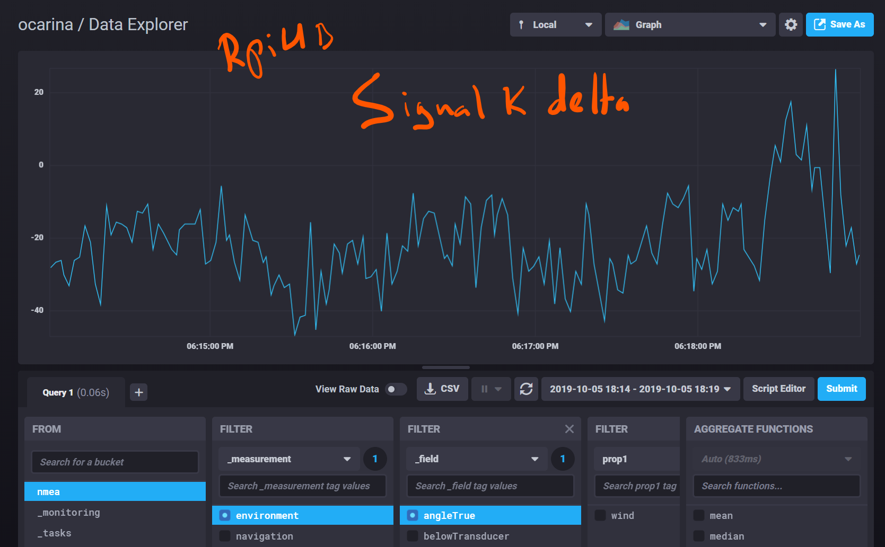
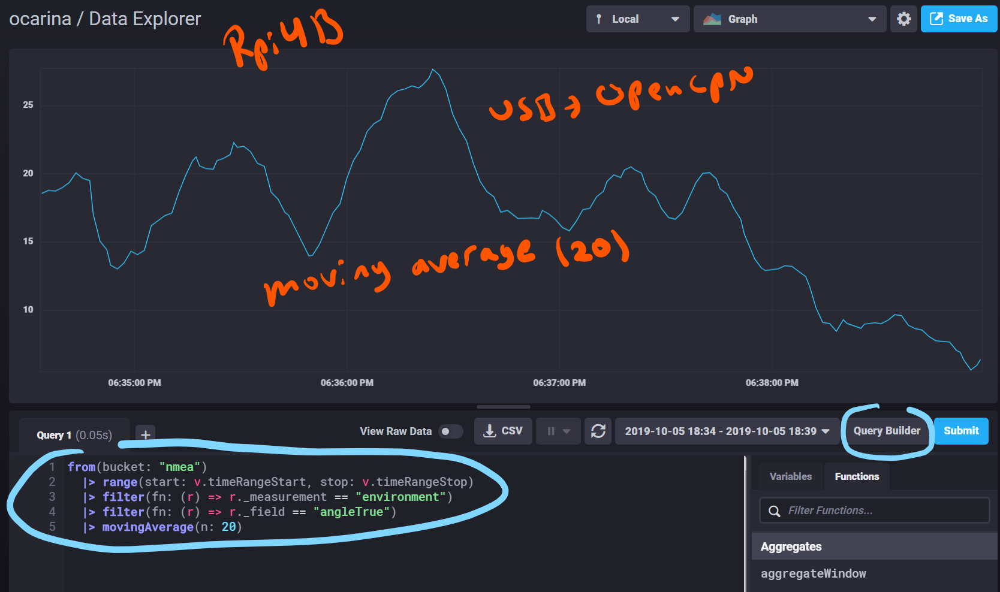

# Comparison of timestamps in three alternative NMEA data paths

### Rasbian "Buster" - OpenCPN v5.0.0 - Signal K v1.17.0 - DashT v.0.5.2 

We observe a five minute sampling period stored in InfluxDB database for each of the use case for single value of Apparent Wind Angle:

1. data via Signal K delta TCP channel with Signal K timestamps at its own reception

2. data via Signal K to NMEA-0183 via TCP channel timestamps at reception at the InfluxDB instruments

3. data directly from USB to OpenCPN

In all above cases the USB is set to 115200 baud at reception on Rasbian "Buster" (Raspberry Pi 4B 4GB) running OpenCPN v5.0.0. Data is originated from Raymarine SeaTalk (4800 baud) and converted to USB in MiniPlex II multiplexer - about 40 values per second are transmitted through this channel but only True Wind Angle timestamp behaviour is observed in this test.

[](2019-10-05_224016_3x_data_series_overview_Rpi.png)


```python
import numpy as np
import pandas as pd
```

## 1. Data via Signal K delta TCP channel

[](2019-10-05_224308_SignalK_delta_zoom_Rpi.png)


```python
df = pd.read_csv("2019-10-05_224308_SignalK_delta_zoom_Rpi.csv", sep=',', header=3)
```


```python
df.head()
```


<div>
<style scoped>
    .dataframe tbody tr th:only-of-type {
        vertical-align: middle;
    }

    .dataframe tbody tr th {
        vertical-align: top;
    }

    .dataframe thead th {
        text-align: right;
    }
</style>
<table border="1" class="dataframe">
  <thead>
    <tr style="text-align: right;">
      <th></th>
      <th>Unnamed: 0</th>
      <th>result</th>
      <th>table</th>
      <th>_start</th>
      <th>_stop</th>
      <th>_time</th>
      <th>_value</th>
      <th>_field</th>
      <th>_measurement</th>
      <th>prop1</th>
    </tr>
  </thead>
  <tbody>
    <tr>
      <td>0</td>
      <td>NaN</td>
      <td>NaN</td>
      <td>0</td>
      <td>2019-10-05T16:14:00Z</td>
      <td>2019-10-05T16:19:00Z</td>
      <td>2019-10-05T16:14:01.169Z</td>
      <td>-28.1</td>
      <td>angleTrue</td>
      <td>environment</td>
      <td>wind</td>
    </tr>
    <tr>
      <td>1</td>
      <td>NaN</td>
      <td>NaN</td>
      <td>0</td>
      <td>2019-10-05T16:14:00Z</td>
      <td>2019-10-05T16:19:00Z</td>
      <td>2019-10-05T16:14:03.106Z</td>
      <td>-26.6</td>
      <td>angleTrue</td>
      <td>environment</td>
      <td>wind</td>
    </tr>
    <tr>
      <td>2</td>
      <td>NaN</td>
      <td>NaN</td>
      <td>0</td>
      <td>2019-10-05T16:14:00Z</td>
      <td>2019-10-05T16:19:00Z</td>
      <td>2019-10-05T16:14:05.045Z</td>
      <td>-26.1</td>
      <td>angleTrue</td>
      <td>environment</td>
      <td>wind</td>
    </tr>
    <tr>
      <td>3</td>
      <td>NaN</td>
      <td>NaN</td>
      <td>0</td>
      <td>2019-10-05T16:14:00Z</td>
      <td>2019-10-05T16:19:00Z</td>
      <td>2019-10-05T16:14:06.049Z</td>
      <td>-30.1</td>
      <td>angleTrue</td>
      <td>environment</td>
      <td>wind</td>
    </tr>
    <tr>
      <td>4</td>
      <td>NaN</td>
      <td>NaN</td>
      <td>0</td>
      <td>2019-10-05T16:14:00Z</td>
      <td>2019-10-05T16:19:00Z</td>
      <td>2019-10-05T16:14:07.956Z</td>
      <td>-33.1</td>
      <td>angleTrue</td>
      <td>environment</td>
      <td>wind</td>
    </tr>
  </tbody>
</table>
</div>


```python
df._value.describe()
```


    count    166.000000
    mean     -21.151807
    std       11.759992
    min      -46.600000
    25%      -28.975000
    50%      -22.100000
    75%      -14.725000
    max       26.500000
    Name: _value, dtype: float64


```python
df1 = pd.to_datetime(df['_time'])
```


```python
df1.describe()
```


    count                                  166
    unique                                 166
    top       2019-10-05 16:15:40.881000+00:00
    freq                                     1
    first     2019-10-05 16:14:01.169000+00:00
    last      2019-10-05 16:18:59.339000+00:00
    Name: _time, dtype: object


```python
df2 = df1.astype(np.int64).div(1e6)
```


```python
df3 = df2.diff()
```


```python
df3.describe()
```


    count     165.000000
    mean     1807.090909
    std       313.462833
    min      1000.000000
    25%      1863.000000
    50%      1931.000000
    75%      1942.999756
    max      2225.000000
    Name: _time, dtype: float64


## 2. Data via Signal K to NMEA-0183 converter TCP channel

[](2019-10-05_224509_SignalK_NMEA_TCP_zoom_Rpi.png)


```python
nf = pd.read_csv("2019-10-05_224509_SignalK_NMEA_TCP_zoom_Rpi.csv", sep=',', header=3)
```


```python
nf.head()
```


<div>
<style scoped>
    .dataframe tbody tr th:only-of-type {
        vertical-align: middle;
    }

    .dataframe tbody tr th {
        vertical-align: top;
    }

    .dataframe thead th {
        text-align: right;
    }
</style>
<table border="1" class="dataframe">
  <thead>
    <tr style="text-align: right;">
      <th></th>
      <th>Unnamed: 0</th>
      <th>result</th>
      <th>table</th>
      <th>_start</th>
      <th>_stop</th>
      <th>_time</th>
      <th>_value</th>
      <th>_field</th>
      <th>_measurement</th>
      <th>prop1</th>
    </tr>
  </thead>
  <tbody>
    <tr>
      <td>0</td>
      <td>NaN</td>
      <td>NaN</td>
      <td>0</td>
      <td>2019-10-05T16:23:00Z</td>
      <td>2019-10-05T16:28:00Z</td>
      <td>2019-10-05T16:23:00.423Z</td>
      <td>19.6</td>
      <td>angleTrue</td>
      <td>environment</td>
      <td>wind</td>
    </tr>
    <tr>
      <td>1</td>
      <td>NaN</td>
      <td>NaN</td>
      <td>0</td>
      <td>2019-10-05T16:23:00Z</td>
      <td>2019-10-05T16:28:00Z</td>
      <td>2019-10-05T16:23:02.379Z</td>
      <td>26.6</td>
      <td>angleTrue</td>
      <td>environment</td>
      <td>wind</td>
    </tr>
    <tr>
      <td>2</td>
      <td>NaN</td>
      <td>NaN</td>
      <td>0</td>
      <td>2019-10-05T16:23:00Z</td>
      <td>2019-10-05T16:28:00Z</td>
      <td>2019-10-05T16:23:04.295Z</td>
      <td>26.1</td>
      <td>angleTrue</td>
      <td>environment</td>
      <td>wind</td>
    </tr>
    <tr>
      <td>3</td>
      <td>NaN</td>
      <td>NaN</td>
      <td>0</td>
      <td>2019-10-05T16:23:00Z</td>
      <td>2019-10-05T16:28:00Z</td>
      <td>2019-10-05T16:23:05.38Z</td>
      <td>26.1</td>
      <td>angleTrue</td>
      <td>environment</td>
      <td>wind</td>
    </tr>
    <tr>
      <td>4</td>
      <td>NaN</td>
      <td>NaN</td>
      <td>0</td>
      <td>2019-10-05T16:23:00Z</td>
      <td>2019-10-05T16:28:00Z</td>
      <td>2019-10-05T16:23:07.104Z</td>
      <td>40.6</td>
      <td>angleTrue</td>
      <td>environment</td>
      <td>wind</td>
    </tr>
  </tbody>
</table>
</div>


```python
nf._value.describe()
```


    count    188.000000
    mean      21.622872
    std        9.844945
    min        0.500000
    25%       13.850000
    50%       22.850000
    75%       29.600000
    max       41.200000
    Name: _value, dtype: float64


```python
nf1 = pd.to_datetime(nf['_time'])
```


```python
nf1.describe()
```


    count                                  188
    unique                                 188
    top       2019-10-05 16:24:50.701000+00:00
    freq                                     1
    first     2019-10-05 16:23:00.423000+00:00
    last      2019-10-05 16:27:59.431000+00:00
    Name: _time, dtype: object


```python
nf2 = nf1.astype(np.int64).div(1e6)
```


```python
nf3 = nf2.diff()
```


```python
nf3.describe()
```


    count     187.000000
    mean     1598.973262
    std       422.940687
    min      1000.000000
    25%      1026.500000
    50%      1877.000000
    75%      1928.000000
    max      2036.000000
    Name: _time, dtype: float64


## 3. Data without Signal K directly from USB

[](2019-10-05_224657_USB_to_O_zoom_Rpi.png)


```python
of = pd.read_csv("2019-10-05_224657_USB_to_O_zoom_Rpi.csv", sep=',', header=3)
```


```python
of.head()
```


<div>
<style scoped>
    .dataframe tbody tr th:only-of-type {
        vertical-align: middle;
    }

    .dataframe tbody tr th {
        vertical-align: top;
    }

    .dataframe thead th {
        text-align: right;
    }
</style>
<table border="1" class="dataframe">
  <thead>
    <tr style="text-align: right;">
      <th></th>
      <th>Unnamed: 0</th>
      <th>result</th>
      <th>table</th>
      <th>_start</th>
      <th>_stop</th>
      <th>_time</th>
      <th>_value</th>
      <th>_field</th>
      <th>_measurement</th>
      <th>prop1</th>
    </tr>
  </thead>
  <tbody>
    <tr>
      <td>0</td>
      <td>NaN</td>
      <td>NaN</td>
      <td>0</td>
      <td>2019-10-05T16:34:00Z</td>
      <td>2019-10-05T16:39:00Z</td>
      <td>2019-10-05T16:34:01.719Z</td>
      <td>8.1</td>
      <td>angleTrue</td>
      <td>environment</td>
      <td>wind</td>
    </tr>
    <tr>
      <td>1</td>
      <td>NaN</td>
      <td>NaN</td>
      <td>0</td>
      <td>2019-10-05T16:34:00Z</td>
      <td>2019-10-05T16:39:00Z</td>
      <td>2019-10-05T16:34:03.658Z</td>
      <td>9.1</td>
      <td>angleTrue</td>
      <td>environment</td>
      <td>wind</td>
    </tr>
    <tr>
      <td>2</td>
      <td>NaN</td>
      <td>NaN</td>
      <td>0</td>
      <td>2019-10-05T16:34:00Z</td>
      <td>2019-10-05T16:39:00Z</td>
      <td>2019-10-05T16:34:05.585Z</td>
      <td>4.1</td>
      <td>angleTrue</td>
      <td>environment</td>
      <td>wind</td>
    </tr>
    <tr>
      <td>3</td>
      <td>NaN</td>
      <td>NaN</td>
      <td>0</td>
      <td>2019-10-05T16:34:00Z</td>
      <td>2019-10-05T16:39:00Z</td>
      <td>2019-10-05T16:34:07.545Z</td>
      <td>1.6</td>
      <td>angleTrue</td>
      <td>environment</td>
      <td>wind</td>
    </tr>
    <tr>
      <td>4</td>
      <td>NaN</td>
      <td>NaN</td>
      <td>0</td>
      <td>2019-10-05T16:34:00Z</td>
      <td>2019-10-05T16:39:00Z</td>
      <td>2019-10-05T16:34:09.462Z</td>
      <td>7.6</td>
      <td>angleTrue</td>
      <td>environment</td>
      <td>wind</td>
    </tr>
  </tbody>
</table>
</div>


```python
of._value.describe()
```


    count    172.000000
    mean      16.232558
    std       10.655020
    min        0.500000
    25%        7.900000
    50%       15.600000
    75%       22.225000
    max       52.100000
    Name: _value, dtype: float64


```python
of1 = pd.to_datetime(of['_time'])
```


```python
of1.describe()
```


    count                                  172
    unique                                 172
    top       2019-10-05 16:36:01.753000+00:00
    freq                                     1
    first     2019-10-05 16:34:01.719000+00:00
    last      2019-10-05 16:38:58.943000+00:00
    Name: _time, dtype: object


```python
of2 = of1.astype(np.int64).div(1e6)
```


```python
of3 = of2.diff()
```


```python
of3.describe()
```


    count     171.000000
    mean     1738.152047
    std       366.632300
    min      1000.000000
    25%      1825.499634
    50%      1925.000000
    75%      1942.500000
    max      2025.999756
    Name: _time, dtype: float64


<hr/>

### Applying moving average

[](2019-10-05_224657_USB_to_O_zoom_Rpi_moving_average.png)


```python
af = pd.read_csv("2019-10-05_224657_USB_to_O_zoom_Rpi_moving_average.csv", sep=',', header=3)
```


```python
af.head()
```


<div>
<style scoped>
    .dataframe tbody tr th:only-of-type {
        vertical-align: middle;
    }

    .dataframe tbody tr th {
        vertical-align: top;
    }

    .dataframe thead th {
        text-align: right;
    }
</style>
<table border="1" class="dataframe">
  <thead>
    <tr style="text-align: right;">
      <th></th>
      <th>Unnamed: 0</th>
      <th>result</th>
      <th>table</th>
      <th>_start</th>
      <th>_stop</th>
      <th>_time</th>
      <th>_value</th>
      <th>_field</th>
      <th>_measurement</th>
      <th>prop1</th>
    </tr>
  </thead>
  <tbody>
    <tr>
      <td>0</td>
      <td>NaN</td>
      <td>NaN</td>
      <td>0</td>
      <td>2019-10-05T16:34:00Z</td>
      <td>2019-10-05T16:39:00Z</td>
      <td>2019-10-05T16:34:33.669Z</td>
      <td>18.570</td>
      <td>angleTrue</td>
      <td>environment</td>
      <td>wind</td>
    </tr>
    <tr>
      <td>1</td>
      <td>NaN</td>
      <td>NaN</td>
      <td>0</td>
      <td>2019-10-05T16:34:00Z</td>
      <td>2019-10-05T16:39:00Z</td>
      <td>2019-10-05T16:34:35.605Z</td>
      <td>18.795</td>
      <td>angleTrue</td>
      <td>environment</td>
      <td>wind</td>
    </tr>
    <tr>
      <td>2</td>
      <td>NaN</td>
      <td>NaN</td>
      <td>0</td>
      <td>2019-10-05T16:34:00Z</td>
      <td>2019-10-05T16:39:00Z</td>
      <td>2019-10-05T16:34:37.541Z</td>
      <td>18.745</td>
      <td>angleTrue</td>
      <td>environment</td>
      <td>wind</td>
    </tr>
    <tr>
      <td>3</td>
      <td>NaN</td>
      <td>NaN</td>
      <td>0</td>
      <td>2019-10-05T16:34:00Z</td>
      <td>2019-10-05T16:39:00Z</td>
      <td>2019-10-05T16:34:39.468Z</td>
      <td>18.995</td>
      <td>angleTrue</td>
      <td>environment</td>
      <td>wind</td>
    </tr>
    <tr>
      <td>4</td>
      <td>NaN</td>
      <td>NaN</td>
      <td>0</td>
      <td>2019-10-05T16:34:00Z</td>
      <td>2019-10-05T16:39:00Z</td>
      <td>2019-10-05T16:34:41.444Z</td>
      <td>19.365</td>
      <td>angleTrue</td>
      <td>environment</td>
      <td>wind</td>
    </tr>
  </tbody>
</table>
</div>


```python
af._value.describe()
```


    count    153.000000
    mean      16.781928
    std        5.240853
    min        5.600000
    25%       13.300000
    50%       17.200000
    75%       20.085000
    max       27.700000
    Name: _value, dtype: float64


<hr/>

## Summary of results

| data path | timestamp | standard deviation | maximum time difference |
| --------- | --------- | :----------------: | :---------------------: |
| 1 Signal K delta | at source | 313 ms | 2225 ms |
| 2 Signal K NMEA TCP | at reception | 423 ms | 2036 ms | 
| 3 USB to OpenCPN | at reception | 367 ms | 2025 ms |

## Conclusion 

Judged by a human eye there is no difference between the three methods - the needles and values are jumping back and forth as always!

The difference will come apparent when we want to eliminate that jumping by applying some statistical and continuous algorithms on the received time series data. The accuracy of the time stamps is, of course important for any time series analysis.

1. It is not surprising that the direct TCP connection to the Signal K emitted delta values is the most efficient what comes to the accuracy of the timestamps - they are set at the reception, _i.e._ at the closest possible position to the source. Although this method is penalized having to transmit also information in its payload to which we are not necessarily willing to be subscribed, the fact that the timestamp travels with the data compensates that inconvenience.

2. The fact that there is so little difference between the timestamp accuracy through the Signal K to NMEA conversion and its actual delta channel is a proof of the excellent quality and effiency of Signal K and npm. Also, the TCP method of OpenCPN is the preferred one since apparently well implemented.

3. One observation in this test using a modest Rasberry Pi 4B board is that it allows similar performances than more powerful i7 CPU based processor under Window 10. Also, the USB streaming implementationin wxWidgets/OpenCPN is now in equal or even better performance than the combined Signal K (USB input) with conversion to TCP which OpenCPN receives. However, the difference in jitter is not significative enough to justify a need to elimate Signal K from the signal chain: using it together with method (1) - direct delta connection - provides still the best overall performance for key parameters.

Finally, the best improvement in this particular case would be to increase the sampling rate, which is, admittely, ridicuosly slow.
