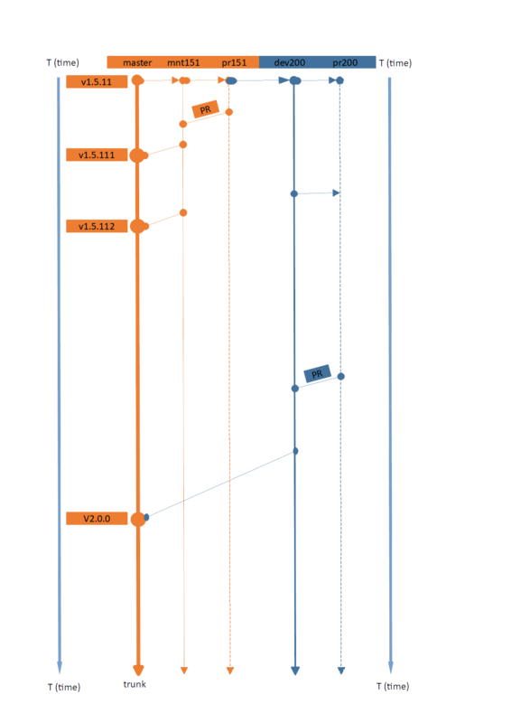

# Information for developers, contributors and collaborators

## Project's situation report February 2020

>[Previous report and roadmap after publication of v1.5.11](https://github.com/canne/dashboard_tactics_pi/blob/c7656142b49c6bb38b3d1c681db9b2426f22193a/docs/developers/README.md)

v2.0 alpha has made a successful POC (proof of concept) which allows to integrate webpack development within the project, enabling instruments similar but not equivalent to the SignalK full-blown browser based instruments. But despite the limitations of wxWebView and its back-ends, they come very close to make them attractive. InfluxDB 2.0 open source version entered beta phase in the beginning of 2020. OpenCPN has embraced Signal K (finally) and is actively developing a Signal K data interface and an event based distribution of that data to plug-ins.

One of the main development paradigms of the v1.5.11 was to maintain compatibility with OpenCPN Dashboard - at that time frozen - in order to provide a way to transfer the numerous improvements into the mother project. Currently, OpenCPN project team is implementing Signal K data event based distribution parser directly into the code base from which this project was forked from.

This project cannot contribute the corrections done for v1.5.11 in Dashboard back to the main project - the overall deviation is now too large. Dashboard's original code base carried over from the Dashboard project will be removed to ease the maintenance effort.

## v1.5.11 roadmap

_v1.5.11_ enters into a minimum maintenance mode which means that only real show-stoppers will be fixed if they concern OpenCPN v5.0. That statement does not concern the upcoming versions of OpenCPN with eventual changes in the plug-in API.

### v1.5.111 - an i18n version

Volunteers are apparently working on providing i18n .po files for the project. Their work will be respected by implementing the pull requests in `pr151` branch and with a publication of eventual v1.5.111 version, and successively v1.5.112, etc. if needed.

## v1.6

From the conclusions above follows that v1.6 hypothesis discussed in the [previous report](https://github.com/canne/dashboard_tactics_pi/blob/c7656142b49c6bb38b3d1c681db9b2426f22193a/docs/developers/README.md) is abandoned and the reserved development branches are deleted.

## v2.0 alpha (v1.98.101) and onwards

Development site's main branch switches to `dev200` branch. `mnt151` branch remains for maintenance work of _v1.5.11_.

Each part above is divided into its own thread structure, presented by two `git` branches:

* Development and testing branch for the project owner(s)
* Staging branch for the solicited and unsolicited pull requests

> **Pull requests to master branch (trunk) are not accepted until dev200 project reaches an advanced beta stage** Please submit any PR here, instead:

* `pr151` - Staging branch for pull requests for bug fixes in v1.5.11 - **no new features will be accepted in this branch**

  * Suitable for small changes like new language files

* `pr200` - For those who wish to contribute to new features, even unstable ones in `dev200` R&D branch

   * **Free spirit R&D and new ideas goes here**
   
   * It would be appreciated if the ideas would be presented with some use case, allowing an assembly of a test use case:
   
     * Please do not get offended if the pull request will not get accepted - this is a hobby project and time is a limited resource ;
     
     * I'll try to comment back to at least thank you for your ideas!

>You may notice occasional _Flying Fish_ branches appear in the repository. They are for not break the development build by some test-only ideas. However, they can be created on simple demand for pull requests not meeting the below requirements of the CI (continuous integration and QA applied in commits and PRs):

Common automatic QA requirements (mandatory to pass) for all branches are
* [Codacy static code analysis](https://app.codacy.com/manual/petri38-github/dashboard_tactics_pi/dashboard)
* [Travis CI for pull requests](https://travis-ci.org/canne/dashboard_tactics_pi)
* [AppVeyor CI for Windows build of commits](https://ci.appveyor.com/project/canne/dashboard-tactics-pi)
* [Travis CI for Linux and Mac builds of commits](https://travis-ci.org/canne/dashboard_tactics_pi)

The below diagram depicts the branch schema starting from this holdpoint and provides a roadmap for future versions - without a time axis due to the lack of that information from the OpenCPN main project.

 [(zoom)](img/v1.98.103_holdpoint_threads.png)
